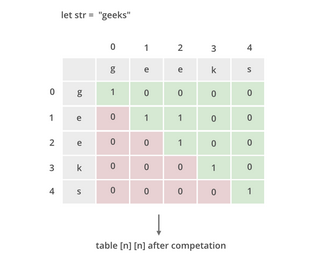

### Strings 

* Reverse words in a given string 

    - S = i.like.this.program.very.much
    - Output: much.very.program.this.like.i
    - Explanation: After reversing the whole
        string(not individual words), the input
        string becomes
        much.very.program.this.like.i

    - Expected Time Complexity: O(|S|)
    - Expected Auxiliary Space: O(|S|)

* Permutations of a given string

    - ABC
    - ABSG
    - Output:
        - ABC ACB BAC BCA CAB CBA 
        - ABGS ABSG AGBS AGSB ASBG ASGB BAGS BASG BGAS BGSA BSAG BSGA GABS GASB GBAS GBSA GSAB GSBA SABG SAGB SBAG SBGA SGAB SGBA 

* Remove all adjacent duplicates 

    - Given a string s, recursively remove adjacent duplicate characters from the string s. The output string should not have any adjacent duplicates.
        - Example
            - Input: azxxzy 
            - Output: ay 
            - First “azxxzy” is reduced to “azzy”. 
            The string “azzy” contains duplicates, 
            so it is further reduced to “ay”.

* Check if string is rotated by two places

    - Given two strings a and b. The task is to find if the string 'b' can be obtained by rotating another string 'a' by exactly 2 places.

    - Input:
    - a = amazon
    - b = azonam
    - Output: 1
    - Explanation: amazon can be rotated anti
        clockwise by two places, which will make
        it as azonam.

* Roman Number to Integer 
    - Given a string in roman no format (s)  your task is to convert it to an integer . Various symbols and their values are given below.
        - I 1
        - V 5
        - X 10
        - L 50
        - C 100
        - D 500
        - M 1000

        - Expected Time Complexity: O(|S|), |S| = length of string S.
        - Expected Auxiliary Space: O(1)

* Longest Palindrome in a String 

    - Given a string S, find the longest palindromic substring in S. Substring of string S: S[ i . . . . j ] where 0 ≤ i ≤ j < len(S). Palindrome string: A string which reads the same backwards. More formally, S is palindrome if reverse(S) = S. Incase of conflict, return the substring which occurs first ( with the least starting index ).

    - NOTE: Required Time Complexity O(n2).
    
    - Input:
        - The first line of input consists number of the testcases. The following T lines consist of a string each.
    
    - Output:
        - In each separate line print the longest palindrome of the string given in the respective test case.

    - Approach

       * Dynamic Programming. 
            * Approach: The time complexity can be reduced by storing results of sub-problems. The idea is similar to this post.  

            * Maintain a boolean table[n][n] that is filled in bottom up manner.
            * The value of table[i][j] is true, if the substring is palindrome, otherwise false.
            * To calculate table[i][j], check the value of table[i+1][j-1], if the value is true and str[i] is same as str[j], then we make table[i][j] true.
            * Otherwise, the value of table[i][j] is made false.
            * We have to fill table previously for substring of length = 1 and length =2 because 
            as we are finding , if table[i+1][j-1] is true or false , so in case of 
            (i) length == 1 , lets say i=2 , j=2 and i+1,j-1 doesn’t lies between [i , j] 
            (ii) length == 2 ,lets say i=2 , j=3 and i+1,j-1 again doesn’t lies between [i , j].
            * 

